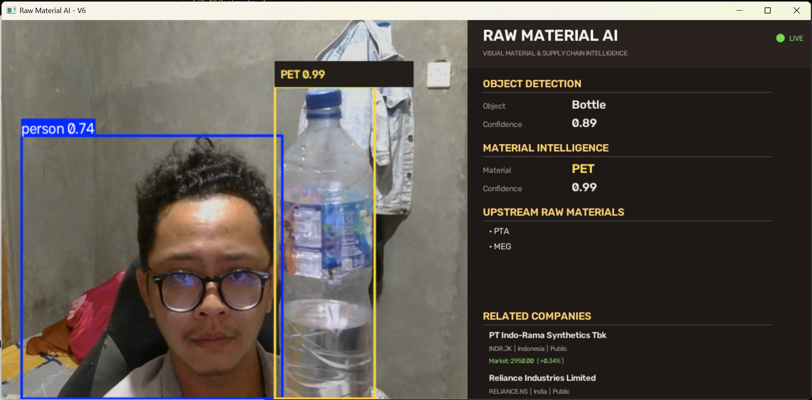
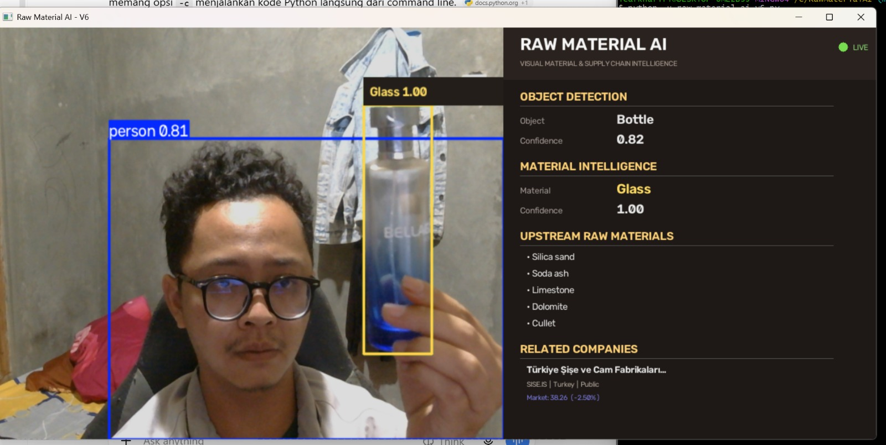

# Raw Material AI

## Visual Material & Supply Chain Intelligence

Raw Material AI is a computer-vision prototype that connects visual object detection with material intelligence and upstream supply-chain information.

The current prototype detects bottles, classifies their material as PET or Glass, maps the material to associated raw materials, and displays related companies and public market information.

## Project Overview

The system follows this pipeline:

**Camera → Object Detection → Material Classification → Raw Materials → Related Companies → Market Data**

## Features

- Real-time bottle detection using YOLO
- PET vs Glass material classification
- Material confidence score
- Upstream raw-material mapping
- Related company lookup
- Company country and public/private status
- Stock ticker information
- Market price and daily change
- Real-time OpenCV dashboard
- JSON-based material and company database

## Current Material Intelligence

### PET

**Material:** PET — Polyethylene Terephthalate

Associated raw materials:

- PTA — Purified Terephthalic Acid
- MEG — Mono Ethylene Glycol

Related companies in the current prototype:

- PT Indo-Rama Synthetics Tbk
- Reliance Industries Limited

### Glass

**Material:** Glass

The current database maps Glass to soda-lime glass.

Associated raw materials:

- Silica sand
- Soda ash
- Limestone
- Dolomite
- Cullet

Related company in the current prototype:

- Türkiye Şişe ve Cam Fabrikaları A.Ş. (Şişecam)

## System Architecture

```text
CAMERA
   |
   v
OBJECT DETECTION
   |
   v
BOTTLE
   |
   v
MATERIAL CLASSIFICATION
   |
   +--------+--------+
   |                 |
   v                 v
  PET              GLASS
   |                 |
   v                 v
PTA + MEG      SODA-LIME GLASS
                     |
                     v
        SILICA SAND / SODA ASH
        LIMESTONE / DOLOMITE
        CULLET
              |
              v
       RELATED COMPANIES
              |
              v
         MARKET DATA
```

## Demo

### PET Bottle



### Glass Bottle



## Technologies

- Python
- OpenCV
- Ultralytics YOLO
- Image Classification
- yfinance
- Pandas
- JSON

## Project Structure

```text
RawMaterialAI/
├── raw_material_ai_v6.py
├── README.md
├── requirements.txt
├── data/
│   ├── materials.json
│   ├── companies.json
│   └── object_map.json
├── models/
│   └── best.pt
└── screenshots/
    ├── pet-demo.png
    └── glass-demo.jpeg
```

## Installation

### Clone the repository

```bash
git clone https://github.com/icafkhafifi/RawMaterialAI.git
cd RawMaterialAI
```

### Install dependencies

```bash
pip install -r requirements.txt
```

### Run

```bash
python raw_material_ai_v6.py
```

Press `Q` to exit.

## Limitations

This project is currently a prototype.

The material classification model was trained using a relatively small dataset containing PET and Glass examples. Therefore, the displayed confidence score should not be interpreted as overall model accuracy.

The current prototype focuses primarily on bottles and two material classes.

Future development includes:

- Larger and more diverse datasets
- Formal validation and test sets
- Additional material classes
- Improved material verification
- Supplier discovery
- Supply-chain mapping
- Price intelligence
- Supply-risk analysis
- Web dashboard
- API access

## Project Status

**Prototype — V6**

Current pipeline:

**Object Detection → Material Classification → Raw Material Mapping → Company Intelligence → Market Data**

## Purpose

The long-term goal of Raw Material AI is to explore how computer vision can connect physical products with upstream material and supply-chain intelligence.

A future version could help answer:

> What is this object?

> What material is it made from?

> What raw materials are associated with that material?

> Which companies participate in the related supply chain?

## Disclaimer

Market information displayed by the prototype is provided for demonstration purposes only and should not be considered financial advice.

Company-material relationships in the prototype are based on the project's current database and should be independently verified before being used for commercial, procurement, or investment decisions.

## License

This project is currently intended as a portfolio and research prototype.

Third-party libraries, models, and datasets remain subject to their respective licenses and terms.
